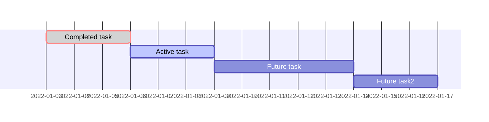
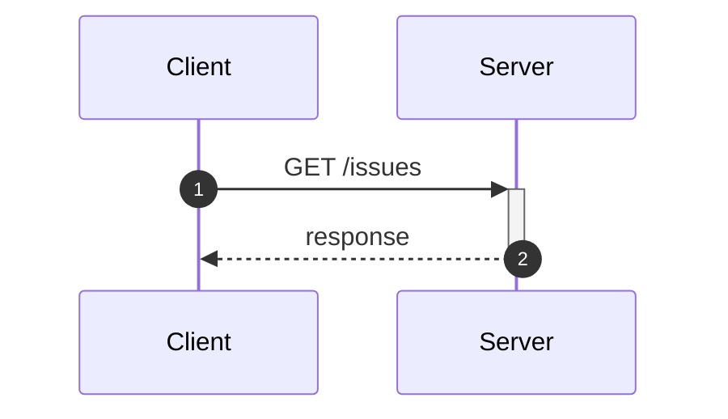

gantt chart

```mermaid
gantt
  Completed task :crit, done,    t1, 2022-01-03, 3d
  Active task    :      active,  t2, after t1,   3d
  Future task    :               t3, after t2,   5d
  Future task2   :                               3d
```

```mermaid
sequenceDiagram
  autonumber
  Client->>+Server: GET /issues
  Server-->>-Client: response
```
