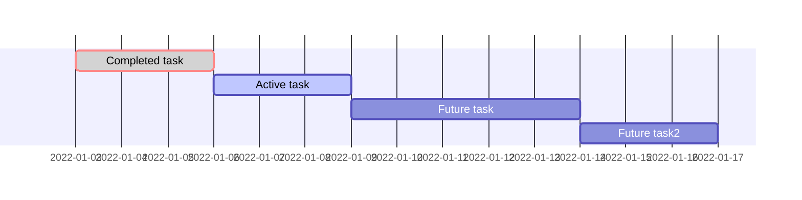
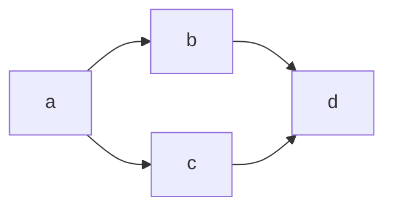
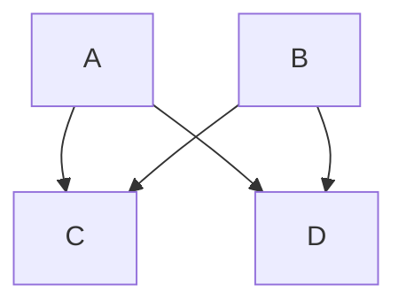
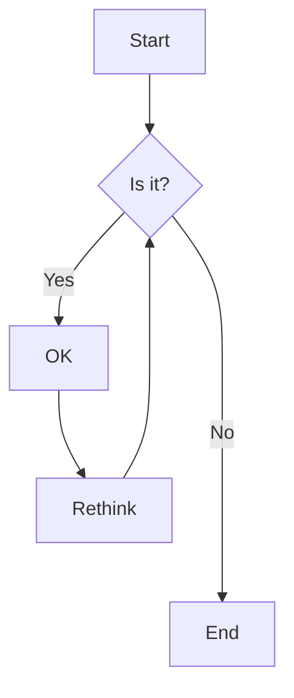
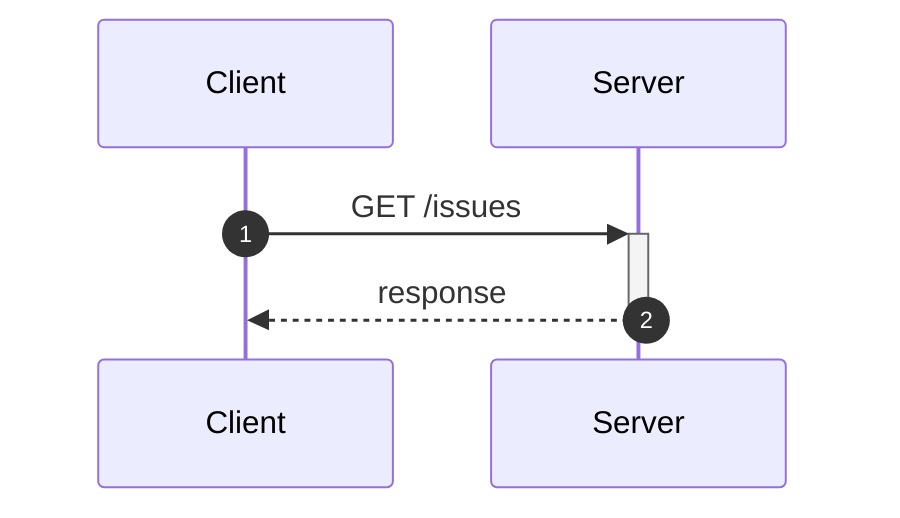
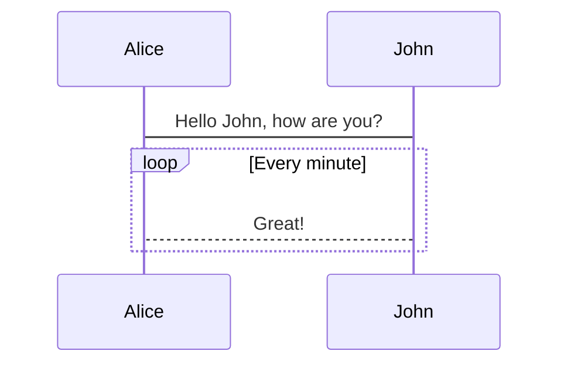
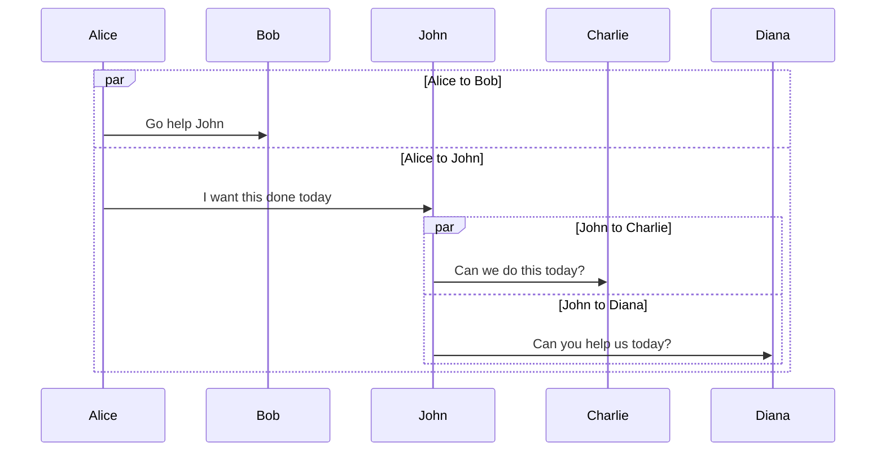

## gantt chart

```mermaid
gantt
  Completed task :crit, done,    t1, 2022-01-03, 3d
  Active task    :      active,  t2, after t1,   3d
  Future task    :               t3, after t2,   5d
  Future task2   :                               3d
```

# flow

```mermaid
flowchart LR
   a --> b & c--> d
```

```mermaid
flowchart TB
    A & B--> C & D
```

```mermaid
flowchart TD
    A[Start] --> B{Is it?}
    B -->|Yes| C[OK]
    C --> D[Rethink]
    D --> B
    B ---->|No| E[End]
```

## sequence

```mermaid
sequenceDiagram
  autonumber
  Client->>+Server: GET /issues
  Server-->>-Client: response
```

```mermaid
sequenceDiagram
    Alice->John: Hello John, how are you?
    loop Every minute
        John-->Alice: Great!
    end
```

```mermaid
sequenceDiagram
    par Alice to Bob
        Alice->>Bob: Go help John
    and Alice to John
        Alice->>John: I want this done today
        par John to Charlie
            John->>Charlie: Can we do this today?
        and John to Diana
            John->>Diana: Can you help us today?
        end
    end
```
